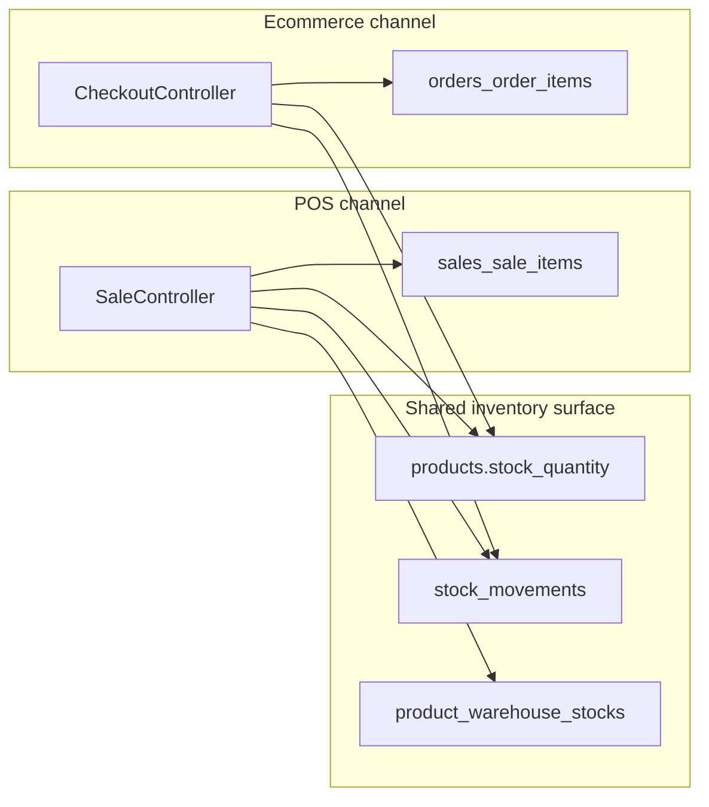
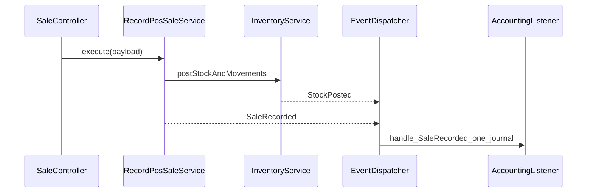
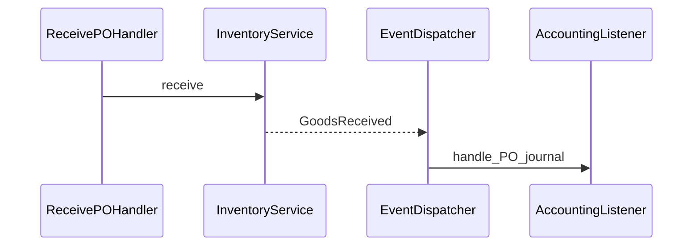

# ERP Platform Architecture Analysis

**Purpose:** Strategic assessment of the current Laravel codebase (`Dashboard`) before backward-compatibility constraints harden.  
**Scope:** POS, Inventory, Ecommerce, Accounting, Administration — as implemented today.  
**Audience:** Founders / architects planning modular evolution toward retail, restaurant, fashion, electronics, services, manufacturing, and omnichannel ecommerce on one core.

**Rule:** This document recommends **structure and sequencing**, not ad-hoc refactors.

---

## Executive summary

The codebase already has valuable pieces: multi-tenant scoping, POS with offline queue + idempotency, warehouse-aware tables, journal generators for sales/refunds/PO/shifts, and a packaged Storefront Builder module. The main risks are **orchestration living in HTTP controllers**, **parallel stock-decrement paths** (POS vs ecommerce vs procurement), **dual stock “truth”** (`products.stock_quantity` vs `product_warehouse_stocks`), **accounting triggers split between model observers and explicit controller calls** (including a concrete duplicate-path risk on POS sales), and a **flat product/variant model** that cannot express configurable matrices, modifiers, BOMs, or workflows without additive domain modeling.

Evolve toward **bounded contexts** (Core, Catalog, Inventory, Sales, POS, Procurement, Manufacturing, Accounting, CRM, Ecommerce) connected by **application services** and **domain events**, not direct cross-controller mutation.

---

## 1. Current architecture map

### 1.1 Runtime layers

| Layer | Implementation |
|-------|------------------|
| HTTP | `routes/web.php` — auth ERP staff + POS + inventory + admin + storefront routes |
| Middleware | `TenantMiddleware`, `LoadTenantSettings`, `SetLocale`, CSRF, session |
| Presentation | Blade (ERP shell + standalone `layouts/pos-app.blade.php`), Alpine store in POS JS |
| Background | Minimal queue usage for POS; broadcasting optional (Pusher/Echo) |

### 1.2 Logical modules (as code is organized today)

| Logical module | Primary locations |
|----------------|-------------------|
| **Administration** | `UserController`, `RoleController`, `TenantController`, `SettingsController`, `TenantManager`, `SettingService`, permissions middleware |
| **POS** | `POSController`, `SaleController`, `public/js/pos-terminal.js`, `public/js/pos/*.js`, views under `resources/views/pos/` |
| **Inventory** | `Inventory\*Controller`, models `Product`, `ProductVariant`, `StockMovement`, `ProductWarehouseStock`, PO/transfers |
| **Ecommerce** | `Store\*Controller`, `Order`/`OrderItem`, session cart; **StorefrontBuilder** under `app/Modules/StorefrontBuilder/` |
| **Accounting** | `AccountingService`, `JournalEntryFactory`, generators under `Services/Accounting/Generators`, web controllers under `Accounting/` |

### 1.3 Channel split (critical)

Two distinct “sell” paths coexist:

1. **POS** → `sales` / `sale_items` (`SaleController`)
2. **Storefront** → `orders` / `order_items` (`CheckoutController`)

Both decrement **`products.stock_quantity`** and write **`stock_movements`**, but **do not share** a single domain service or aggregate — reporting and accounting semantics can drift.



---

## 2. What already exists (and is worth preserving)

| Area | Why it is good |
|------|----------------|
| **Multi-tenant** | `BelongsToTenant`, `TenantMiddleware`, tenant-scoped queries |
| **POS resilience** | Offline queue, `client_idempotency_key`, contracts in `pos-contracts.js` |
| **Accounting generators** | `JournalEntryFactory` + per-document generators (`Sale`, `Refund`, `PurchaseOrder`, `PosShift`) — correct direction for pluggable rules |
| **Broadcasting hooks** | `InventoryBulkUpdated`, `PosSaleCompleted` — optional realtime without blocking POS |
| **Warehouse schema** | `product_warehouse_stocks` + variant FK supports multi-location |
| **StorefrontBuilder as module** | Precedent for packaging bounded contexts under `app/Modules/` |

---

## 3. Dangerous long-term patterns

### 3.1 Stock truth model

- **`products.stock_quantity`** is decremented everywhere (POS, ecommerce checkout, PO receive increments).
- **`product_warehouse_stocks`** holds per-warehouse (and optional variant) quantities for POS when shift has `warehouse_id`.
- **Risk:** Two representations without enforced invariants → reconciliation bugs and wrong availability at scale.

### 3.2 POS availability vs persistence

- POS sale validation checks **`product.stock_quantity`** only; warehouse rows are updated in parallel when shift has warehouse — **skew** if warehouse is canonical.

### 3.3 Accounting: duplicate trigger risk on POS sales

- `Sale::observe(AccountingObserver)` runs **`created`** → builds journal via `SaleJournalEntryGenerator`.
- `SaleController@store` **also** calls `JournalEntryFactory::getGenerator($sale)` and `AccountingService::createJournalEntry` inside the **same** transaction after line items are written.

**Unless one path is disabled in runtime**, this yields **two journal entries per sale** (or the first throws and rolls back the sale — still brittle).

### 3.4 Procurement observer mismatch

- `AccountingObserver` fires on `PurchaseOrder` when `status === 'completed'`.
- `PurchaseOrderController::receive` sets status to **`received`** (not `completed`).

So **automated PO receipt journals via this observer likely never run** as written — procurement accounting may rely on other paths or be incomplete.

### 3.5 Ecommerce vs accounting

- Store checkout creates **`Order`** only; **no** automatic linkage to the same journal pipeline used for **`Sale`** unless implemented elsewhere — **channel accounting gap**.

### 3.6 Product evolution ceiling

- **`product_variants`** are flat rows (`name`, `sku`, `barcode`, prices) with **no** attribute axes, modifier groups, BOM links, or service attributes — fine for MVP, **insufficient** for universal configurable engine without **additive** Catalog tables.

---

## 4. Tight coupling (what talks to what incorrectly)

| From | To | Problem |
|------|-----|---------|
| `SaleController` | Product stock, warehouse stock, movements, JE, activity, broadcast | **God orchestrator** — POS HTTP layer owns inventory + accounting |
| `CheckoutController` | Product stock + movements | Duplicates inventory mutation semantics without shared service |
| `AccountingObserver` + `SaleController` | Same `Sale` journal | **Overlapping responsibilities** |
| POS JS | Backend contracts | Acceptable; risk is **lack of versioned server API** for cart/sale as catalog grows |
| Config | `config('app.tax_rate')` | Global tax — not tenant/channel/product aware |

---

## 5. What needs redesign **now** (strategic, ordered)

1. **Single accounting entry path per aggregate** (`Sale`, `PurchaseOrder`, …): observer **or** explicit domain listener — not both for the same event.
2. **Align PO receive status** with accounting observer contract **or** remove observer and post journals from an explicit `GoodsReceived` handler.
3. **Define canonical stock model** (rolled-up vs warehouse-only vs reservations) **before** building modifiers/BOM.
4. **Introduce a shared “record sale / fulfill order” application service** façade used by POS and ecommerce eventually.
5. **Catalog boundary** for configurable products: **do not** overload `sale_items` JSON silently — plan normalized children tables or immutable snapshot blobs.

---

## 6. Recommended independent modules (target boundaries)

| Module | Owns | Does not own |
|--------|------|----------------|
| **Core** | Tenant, identity contracts, cross-cutting config interfaces | Product definitions |
| **Catalog** | Product templates, attributes, options, modifiers (future), BOM references | Stock quantities |
| **Inventory** | Stock ledger, reservations, costing inputs, warehouse math | Payment capture |
| **Sales** | Orders/sales aggregates per channel, pricing snapshots, payments state machine | Terminal UI |
| **POS** | Cashier UX, offline queue, hardware, customer display | Core inventory rules |
| **Procurement** | PO lifecycle, receiving | Retail checkout |
| **Accounting** | JE posting, mappings, periods | Physical stock |
| **CRM** | Customer master, segments | Orders |
| **Ecommerce** | Storefront presentation, session cart | ERP authorization rules |

**Communication:** contracts (DTOs) + **domain events** + read APIs — not direct controller-to-controller calls.

---

## 7. Recommended domain events (first wave)

Replace scattered side effects with explicit events (internal Laravel events first; broadcast subscribers optional).

| Event | When |
|-------|------|
| `SaleRecorded` / `WebOrderPlaced` | After persist + stock posted |
| `StockMovementsPosted` | After ledger rows committed |
| `GoodsReceived` | PO receive complete |
| `RefundRecorded`, `SaleVoided` | Already have generators — unify triggers |
| `LowStockBreached` | Replace inline notify loops |

Subscribers: Accounting (single JE builder per event), Notifications, Search index, Analytics.

---

## 8. Recommended application / domain services

| Service | Responsibility |
|---------|----------------|
| `RecordPosSaleService` | Validates shift/tenant/plan; delegates stock; emits `SaleRecorded` |
| `RecordWebOrderService` | Same for `Order` channel |
| `PostStockMovementService` | Single writer for movements + warehouse rows + rolled-up field if kept |
| `AllocateStockForSale` | Enforces availability rule chosen by tenant |
| `PricingService` | Channel + customer group + tax resolution (replaces raw `config` tax for serious use) |

**Keep:** `JournalEntryGenerator` classes — wire them from **one** listener per document type.

---

## 9. Safe phased migration strategy

| Phase | Focus | Outcome |
|-------|--------|---------|
| **A** | Audit & fix accounting triggers (Sale + PO status) | No duplicate/missing JE |
| **B** | Extract `StockPosting` used by POS checkout + ecommerce checkout | One mutation path |
| **C** | Introduce domain events for sale/order recorded | Decouple accounting |
| **D** | Catalog schema for features/modifiers/BOM (additive) | No breakage of flat variants |
| **E** | POS configurator API + payload versioning | Parallel old/new cart shapes |

**Do not** big-bang rewrite Blade/JS until server seams exist.

---

## 10. What should NOT change yet

- Tenant middleware and scoping model  
- POS offline queue + idempotency keys  
- Existing **`sales` / `sale_items`** shape as baseline — extend with new tables/columns, don’t rewrite history  
- Generator-based accounting math (iterate triggers only)  
- Broadcast as optional transport  

---

## 11. Future manufacturing compatibility

**Current gaps:** No BOM, routing, work orders, issue/receipt of components, lot tracking, or cost rollup at operation level.

**Evolution:** Treat manufacturing as **Inventory + Workflow** bounded context:

- `BillOfMaterial`, `ManufacturingOrder`, issue movements (component out), receipt movements (finished good in).
- **Do not** represent BOM lines as retail variants.

**Database:** additive tables; link `stock_movements` to MO references.

---

## 12. Future restaurant compatibility

**Current gaps:** Modifiers are not modeled; kitchen fulfillment is not a workflow; `Sale` is retail-shaped.

**Evolution:**

- **Modifiers** at sale time with optional inventory linkage (SKU-backed cheese).
- **Fulfillment state machine** (`Submitted` → `InKitchen` → `Served`) as separate read model from payment capture.
- Events: `TicketSentToKitchen`, `CourseCompleted`.

Avoid encoding toppings as **variants** unless they are stock-bearing SKUs.

---

## 13. Future configurable-product compatibility

**Current:** `product_variants` + `sale_items.product_variant_id` support simple matrix pricing.

**Needed for universal engine:**

- **Catalog:** `features`, `feature_options`, assignments to products, optional **generated** variant rows + `variant_option_values` mapping — **or** snapshot-only cart lines with frozen option IDs.
- **Sale lines:** support modifier lines and JSON snapshots for receipts/refunds.

**Evolution path:** extend Catalog + Sales line tables; POS payload versioning in `Pos.Contracts`.

---

## 14. Recommended folder / module structure (incremental)

```text
app/Domain/{Catalog,Inventory,Sales,Accounting,Procurement}/
app/Application/{Pos,Ecommerce}/          # use cases
app/Http/Controllers/                     # thin
app/Modules/StorefrontBuilder/            # existing pattern for new packages
```

Interfaces at boundaries: `StockAllocator`, `SaleRecorder`, `TaxResolver`.

---

## 15. Event-driven flow examples (target)

### POS sale (target)



### Goods receipt (target)



---

## 16. Technical debt risks if restructuring is deferred

| Risk | Effect |
|------|--------|
| Duplicate/missing journals | Financial statements wrong |
| Dual stock truth | Overselling, angry audits |
| POS + web divergence | Omnichannel impossible without rewrite |
| Flat variants only | Every industry workaround becomes spaghetti |
| Controller orchestration | Untestable rules, slow change |
| Global tax config | Multi-region rollout blocked |

---

## 17. Answers to “very important questions”

1. **Controllers with too much logic:** `SaleController`, `CheckoutController`, parts of `PurchaseOrderController::receive`.
2. **Incorrect direct mutation:** POS and ecommerce both touch product stock without shared domain layer; accounting wired two ways for sales.
3. **Workflows → domain events:** Sale completed, stock posted, PO received, refund issued.
4. **Extract:** Stock posting, sale recording, pricing/tax resolution.
5. **Scale breakage:** Omnichannel reporting, multi-warehouse truth, accounting reconciliation.
6. **Dangerous DB patterns:** Dual stock columns without invariant; flat variants without attribute graph.
7. **Manufacturing:** No BOM/work order — cannot schedule or cost properly until added.
8. **Restaurant:** No modifier/kitchen workflow layer.
9. **Configurable products:** Current schema insufficient — needs Catalog extension + line snapshots.
10. **Keep:** Tenant model, JE generators, POS offline/idempotency, modular storefront precedent.

---

## 18. Product architecture evolution (summary)

| Capability | Today | Evolution |
|------------|-------|-----------|
| Matrix SKU | `product_variants` | + option linkage or generator |
| Modifiers | UI-only name concat | `modifier_groups` / sale line children |
| BOM | — | New manufacturing tables |
| Services | Time not modeled | Catalog service attributes + scheduling domain later |
| Pricing | Product + variant prices | Channel pricing + adjustments |
| Cart payload | `id`, `qty`, `price`, `variant_id`, discounts | Versioned + `selections[]`, `modifiers[]` |

---

*Document version: 1.0 — codebase snapshot analysis. Update when major refactors land.*
