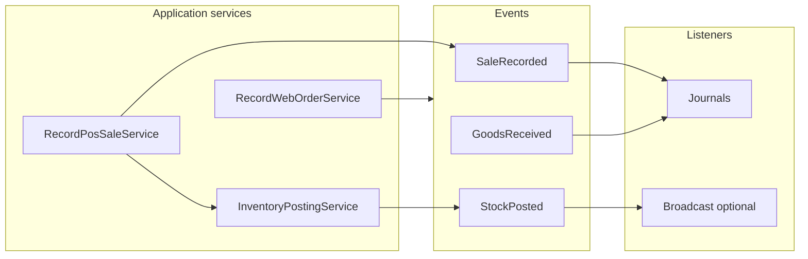

# Foundation Extraction Phase — Architecture Blueprint

**Status:** Planning document — execute incrementally after review.  
**Complements:** [ERP_PLATFORM_ARCHITECTURE_ANALYSIS.md](./ERP_PLATFORM_ARCHITECTURE_ANALYSIS.md)

**Strategic shift:** From “features inside the current ERP” to **bounded contexts**, **application services**, **domain events**, and **reusable seams** — **not** manufacturing screens, POS modifiers, or controller patching as the first move.

---

## 1. Proposed extraction plan (high level)

| Wave | Goal | Outcome |
|------|------|---------|
| **W0 — Decisions** | Lock inventory truth + accounting trigger ownership | Written ADRs; no code or minimal flags |
| **W1 — Infrastructure seams** | Event dispatcher wiring, empty interfaces, first events as **internal** Laravel events | No behavior change yet |
| **W2 — Inventory posting** | Extract `InventoryPostingService` (or equivalent); POS + ecommerce + PO receive **call** it internally | Same DB writes, one code path |
| **W3 — Accounting listeners** | Single subscriber per document type; remove duplicate observer/controller JE paths | Balanced books; tested |
| **W4 — Sales recording** | Extract `RecordPosSale` / `RecordWebOrder` façades; thin controllers | Same HTTP contracts |
| **W5 — Domain events** | Emit `SaleRecorded`, `StockPosted`, `GoodsReceived`, `RefundRecorded` from services | Listeners replace inline side effects |
| **W6 — Catalog boundary** | Namespace + docs only first; move **read models** behind interfaces — **no** new modifier tables until Catalog slice is stable | POS consumes APIs, not Catalog internals |

**Rule:** Each wave ships behind existing routes; feature flags optional for risky paths only.

**ADRs (formal decisions):** [docs/adr/README.md](./adr/README.md) — ADR-001 through ADR-005.

**Transaction & idempotency analysis:** [FOUNDATION_TRANSACTION_AND_IDEMPOTENCY_ANALYSIS.md](./FOUNDATION_TRANSACTION_AND_IDEMPOTENCY_ANALYSIS.md).

**Implementation + tests + first slice:** [FOUNDATION_IMPLEMENTATION_PLAN.md](./FOUNDATION_IMPLEMENTATION_PLAN.md).

---

## 2. Proposed folder structure (gradual, not big-bang)

Introduce directories **as code moves**, not empty scaffolding everywhere.

```text
app/
├── Core/                          # NEW — tenant/auth contracts, IDs, cross-cutting interfaces
│   └── Contracts/                 # e.g. TenantAware, ClockPort (later)
│
├── Domain/                        # NEW — pure domain + policies (optional early)
│   ├── Inventory/
│   │   └── StockPostingPolicy.php # pure rules when extracted
│   ├── Sales/
│   └── Catalog/                   # placeholders when Product reads split
│
├── Application/                   # NEW — use cases / orchestrators
│   ├── Inventory/
│   │   └── PostStockMovementService.php
│   ├── Sales/
│   │   ├── RecordPosSaleService.php
│   │   └── RecordWebOrderService.php
│   └── Accounting/
│       └── (optional façade over generators)
│
├── Infrastructure/               # NEW — later: adapters (ERP persists today stay in Models/)
│   └── (defer concrete adapters until Domain interfaces exist)
│
├── Events/                       # EXPAND — domain events (app-wide naming)
│   ├── Inventory/
│   ├── Sales/
│   └── Procurement/
│
├── Listeners/                    # NEW or consolidate under App\Listeners
│   ├── RecordSaleJournal.php
│   └── RecordGoodsReceivedJournal.php
│
├── Http/Controllers/             # SHRINK — thin HTTP only
├── Models/                       # STAYS for now — gradual migration to Domain entities only if team adopts
└── Modules/
    └── StorefrontBuilder/        # EXISTING precedent — keep pattern for future Catalog package
```

**Naming principle:** `Application\*` = orchestration; `Domain\*` = rules without HTTP; `Infrastructure\*` = Eloquent/repos later.

---

## 3. Services to extract first (priority order)

### Priority 1 — `InventoryPostingService` (name flexible)

**Owns:**

- Creating **`stock_movements`** rows consistently (types, references, before/after when applicable).
- Updating **`product_warehouse_stocks`** for `(product_id, product_variant_id|null, warehouse_id)`.
- Updating **`products.stock_quantity`** **if** rolled-up field remains canonical or derived — **policy injected** (see §5).

**Does not own:** Payment, journal entries, POS UI.

**Callers (phase-in):** `SaleController` (loop body), `CheckoutController` (loop body), `PurchaseOrderController::receive`.

### Priority 2 — `RecordPosSaleService` (application)

**Owns:** Orchestrating validation → persist `Sale` + `SaleItem` → call `InventoryPostingService` → emit `SaleRecorded` / `StockPosted`.

**Does not own:** Alpine/Blade; HTTP status mapping stays in controller.

### Priority 3 — `RecordWebOrderService`

Same pattern for `Order` / `OrderItem` + stock posting — prepares **unified semantics** even if tables stay separate short-term.

### Priority 4 — Accounting **listeners** only (not new generators)

Subscribe to domain events; invoke existing **`JournalEntryFactory` + `AccountingService`**.

---

## 4. Event flow design (foundation)

### 4.1 Internal Laravel events first (sync/async queue later)

| Event | Payload (minimal) | Emit after |
|-------|-------------------|------------|
| `StockPosted` | tenant_id, movements[], reason, source_ref | Successful persist of movements + warehouse rows |
| `SaleRecorded` | sale_id, channel: pos, snapshot totals | Sale + items committed |
| `WebOrderRecorded` | order_id | Order + items committed |
| `GoodsReceived` | purchase_order_id, warehouse_id, lines[] | PO receive transaction committed |
| `RefundRecorded` | refund_id / sale_id | Refund persisted |

### 4.2 Listeners (single responsibility)

| Listener | Action |
|----------|--------|
| `PostSaleJournalListener` | One JE per `SaleRecorded` — uses existing `SaleJournalEntryGenerator` |
| `PostRefundJournalListener` | On `RefundRecorded` |
| `PostGoodsReceivedJournalListener` | On `GoodsReceived` — aligns with PO generator expectations |
| `BroadcastInventoryListener` | Optional: maps to existing `InventoryBulkUpdated` broadcast |

**Remove:** Duplicate JE creation paths — **either** drop `AccountingObserver` for `Sale` **or** remove manual JE from controller **after** listener verified (§6).

### 4.3 Diagram (target)



---

## 5. Inventory truth strategy proposal

### 5.1 Problem

Today: **`products.stock_quantity`** and **`product_warehouse_stocks`** both updated ad hoc; POS validates only global quantity.

### 5.2 Recommended direction (early-stage friendly)

**Canonical quantity per stockable key:** `(tenant_id, product_id, product_variant_id|null, warehouse_id)` in **`product_warehouse_stocks`**.

**`products.stock_quantity`:** Treat as **derived cache** (sum across warehouses for default warehouse mode) **or** “default warehouse only” — **pick one rule per tenant** via settings:

- `inventory.mode = single_warehouse | multi_warehouse`
- Single-warehouse tenants: one warehouse row mirrors legacy column for compatibility.

**POS validation:** When shift has `warehouse_id`, availability = **`product_warehouse_stocks.quantity`** for that key (minus optional reservations later). When no warehouse, fall back to rolled-up rule documented in ADR.

**Reservations (foundation only):** Introduce **`stock_reservations`** table later **or** nullable `reserved_quantity` on warehouse stock — **do not block** W2 extraction; stub interface `ReservationPort` with no-op implementation first.

### 5.3 ADR deliverable

Short **ADR-001: Inventory source of truth** signed off before changing validation logic.

---

## 6. Accounting orchestration proposal

### 6.1 Current issue

- **`AccountingObserver::created(Sale)`** posts journal.
- **`SaleController@store`** posts journal again inside transaction.

### 6.2 Target

**Single trigger:** `SaleRecorded` event → **`PostSaleJournalListener`** → generator.

**Steps:**

1. Disable JE in **`SaleController`** body (temporary feature flag or immediate removal once tests pass).
2. Remove **`Sale` observer registration** for accounting **or** replace observer with thin “dispatch SaleRecorded” if sale created outside controller someday.
3. Ensure **`SaleJournalEntryGenerator`** receives sale with **final totals** (already true if event fires after commit — prefer **`SaleRecorded` dispatched after `DB::transaction` commits** using `DB::afterCommit` or transaction callback).

**Purchase orders:** Align **`GoodsReceived`** with **`PurchaseOrder` status** (`received` vs `completed`) so **`PurchaseJournalEntryGenerator`** runs once on correct transition.

### 6.3 Ecommerce orders

Decide explicitly: **journal on payment capture** vs **on order placement** — document in ADR-002; listener implements decision once.

---

## 7. Sales domain unification proposal

### 7.1 Short term (minimal breakage)

Keep **`sales`** and **`orders`** tables.

Introduce shared concepts in **application layer**:

- **`SalesChannel` enum:** `pos`, `web`, `admin`, future `api`.
- **`RecordedSale` DTO** — abstract shape: lines, totals, customer ref, channel — mapped **to/from** `Sale` or `Order`.

### 7.2 Medium term

- Unified **`commerce_orders`** view or reporting projection — **read model**, not migration blocker.
- Optional **`sale_channel`** column on both tables if reporting needs it.

### 7.3 Long term

Single **`orders`** aggregate with `channel` — **only** after migration story exists; **not** Phase 1 extraction.

---

## 8. Catalog vs Inventory (ownership)

| Concern | Owner |
|---------|--------|
| Product definition, attributes, modifiers (future), BOM links (future), pricing metadata | **Catalog** domain / tables |
| Quantities, movements, costing quantities | **Inventory** |
| Line-item snapshot on checkout | **Sales** (persist frozen JSON or normalized child rows) |

**Phase 1:** Document boundaries + namespaces; **do not** move all models yet. POS reads catalog via existing feeds until Catalog API is formalized.

---

## 9. Safe migration sequencing

| Step | Action | Risk |
|------|--------|------|
| 1 | Write ADR: inventory truth + accounting trigger | None |
| 2 | Add **`InventoryPostingService`**, call from **one** path (e.g. PO receive only) + tests | Low |
| 3 | Switch POS sale stock loop to service (same DB effects) | Medium — integration tests |
| 4 | Switch ecommerce checkout to service | Medium |
| 5 | Introduce events + listeners; remove duplicate JE | High — **must** reconcile observer |
| 6 | Dispatch events `afterCommit` | Medium |
| 7 | Thin controllers to single-line delegate | Low |
| 8 | Namespace Catalog interfaces (no schema change) | Low |

**Rollback:** Each step reversible via git; avoid simultaneous JE + observer changes without tests.

---

## 10. Which files/controllers should shrink first

| File | Current role | Target |
|------|--------------|--------|
| [`app/Http/Controllers/POS/SaleController.php`](app/Http/Controllers/POS/SaleController.php) | Orchestrates sale + stock + JE + broadcast | Delegate to `RecordPosSaleService`; strip JE block |
| [`app/Http/Controllers/Store/CheckoutController.php`](app/Http/Controllers/Store/CheckoutController.php) | Duplicates stock logic | Delegate to `RecordWebOrderService` + shared posting |
| [`app/Http/Controllers/Inventory/PurchaseOrderController.php`](app/Http/Controllers/Inventory/PurchaseOrderController.php) (`receive`) | Stock + status | Delegate posting + emit `GoodsReceived` |
| [`app/Observers/AccountingObserver.php`](app/Observers/AccountingObserver.php) | Duplicate trigger | Remove/split once listeners stable |
| [`app/Providers/EventServiceProvider.php`](app/Providers/EventServiceProvider.php) | Registers observers | Register event/listener map |

**Later:** Refund/void paths in `SaleController` — same event pattern.

---

## 11. Implementation order (minimal breakage risk)

1. **Tests:** Characterization tests for POS sale + PO receive + web checkout (stock counts, movement rows) — if missing, add minimal suite.
2. **`InventoryPostingService`** extracted; **PO receive** migrated first (lowest user-visible surface).
3. **Ecommerce** checkout migrated second (isolated flow).
4. **POS** `SaleController` migrated third (highest scrutiny).
5. **Accounting:** Remove duplicate path; wire **`SaleRecorded`** listener; verify single JE per sale.
6. **Events** formalized in `app/Events/` with namespaces.
7. **Controller slimming** — cosmetic once internals stable.
8. **Catalog** namespace + interfaces — documentation and **one** read boundary (e.g. `Catalog\ProductReader` wrapping `Product` query for POS feed).

---

## 12. Manufacturing compatibility (preparation only)

- **`InventoryPostingService`** accepts **reason codes** (`pos_sale`, `goods_receipt`, future `mo_issue`, `mo_receipt`).
- Events **`StockPosted`** carry enough metadata for costing subscribers later.
- **No** BOM tables in this phase — only **extension points** (interfaces, event payloads).

---

## 13. What NOT to do in this phase

- Add modifier/feature tables to production DB without Catalog ADR.
- Rewrite all Blade/JS POS UI.
- Merge `sales` and `orders` tables.
- Introduce microservices or separate repos.

---

## 14. Success criteria for “foundation extraction” phase

- [ ] One inventory posting implementation used by POS, web, and PO receive.
- [ ] One accounting path per sale (no duplicate JE).
- [ ] Domain events exist for sale recorded, stock posted, goods received (internal dispatch).
- [ ] Controllers primarily validate HTTP and delegate.
- [ ] ADRs document inventory truth and accounting triggers.
- [ ] No regression in POS offline queue or idempotency contracts.

---

## 15. Relation to product engine (Catalog)

All configurable product work **waits** behind:

1. Stable **`InventoryPostingService`** + stock truth ADR.
2. Stable **sales recording** + events.
3. **Catalog** bounded context folder + interfaces — then schema for features/modifiers/BOM **inside Catalog**, consumed by Sales/POS via contracts — **not** embedded in POS controllers.

---

*End of foundation extraction blueprint. Next step: review ADRs W0, then implement W2 posting service behind tests.*
