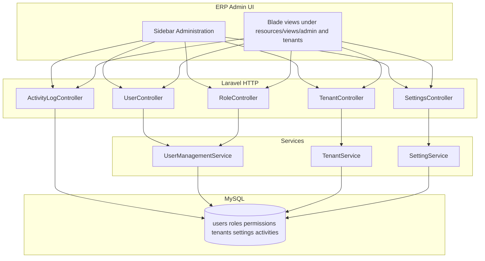

# Administration – Technical Design Document (TDD)

> **Note**: In this folder, **TDD** means **Technical Design Document** (solution architecture). It is not “test-driven development.”

## 1. Purpose

Describe how the **Administration** module is implemented in Senso-ERP: **routing**, **controllers**, **services**, **authorization**, **persistence**, and **extension points**. Paths refer to the repository root.

---

## 2. High-level architecture

---

## 3. Routing (`routes/web.php`)

Routes are registered inside the authenticated ERP group. Named routes drive the sidebar in `resources/views/layouts/main-sidebar.blade.php`.

### 3.1 User Management

| Method | URI | Name | Controller action |
| ------ | --- | ---- | ------------------- |
| REST | `admin/users` | `admin.users.*` | `UserController` |
| POST | `admin/users/{user}/toggle` | `admin.users.toggle` | `toggleStatus` |
| POST | `admin/users/{user}/lock` | `admin.users.lock` | `lock` |
| POST | `admin/users/{user}/unlock` | `admin.users.unlock` | `unlock` |
| POST | `admin/users/{user}/reset-password` | `admin.users.reset-password` | `resetPassword` |
| POST | `admin/users/{user}/force-change-password` | `admin.users.force-change-password` | `forceChangePassword` |

**Authorization**: Constructor middleware restricts `index` / `show` to admin **or** `users.view` permission. Other `UserController` actions currently inherit only the outer `auth` middleware group—tighten with `users.create` / `users.edit`-style checks if product policy requires parity with list access.

### 3.2 Role Management

| Method | URI | Name | Controller action |
| ------ | --- | ---- | ------------------- |
| REST | `admin/roles` | `admin.roles.*` | `RoleController` |

> **Implementation note**: `RoleController::permissions()` exists for JSON permission ids but **no dedicated route** is declared in `routes/web.php` at the time of writing; register one if external clients or SPA calls need it.

### 3.3 Tenant Management

| Method | URI | Name | Controller action |
| ------ | --- | ---- | ------------------- |
| REST | `tenants` | `tenants.*` | `TenantController` |
| POST | `tenants/{tenant}/toggle` | `tenants.toggle` | `toggleStatus` |
| POST | `tenants/{tenant}/suspend` | `tenants.suspend` | `suspend` |
| POST | `tenants/{tenant}/activate` | `tenants.activate` | `activate` |
| POST | `tenants/{tenant}/upgrade-plan` | `tenants.upgrade-plan` | `upgradePlan` |
| POST | `tenants/{tenant}/login-as` | `tenants.login-as` | `loginAs` |
| POST | `tenants/{tenant}/sync-usage` | `tenants.sync-usage` | `syncUsage` |
| PATCH | `tenants/{tenant}/settings` | `tenants.settings` | `updateSettings` |

### 3.4 Settings

| Method | URI | Name | Controller action |
| ------ | --- | ---- | ------------------- |
| GET | `/admin/settings` | `admin.settings` | `SettingsController@index` |
| POST | `/admin/settings` | `admin.settings.store` | `SettingsController@store` |

### 3.5 Activity Log

| Method | URI | Name | Controller action |
| ------ | --- | ---- | ------------------- |
| GET | `/admin/activity` | `admin.activity.index` | `ActivityLogController@index` |
| GET | `/admin/activity/{activity}` | `admin.activity.show` | `ActivityLogController@show` |

**Authorization**: Admin-only middleware in `ActivityLogController` constructor.

---

## 4. Core components

| Concern | Location |
| ------- | -------- |
| Users | `App\Http\Controllers\UserController`, `App\Services\UserManagementService`, `App\Models\User` |
| Roles | `App\Http\Controllers\RoleController`, `UserManagementService`, `App\Models\Role` |
| Tenants | `App\Http\Controllers\TenantController`, `App\Services\TenantService`, `App\Models\Tenant` |
| Settings | `App\Http\Controllers\SettingsController`, `App\Services\SettingService`, `App\Models\Setting` |
| Activity | `App\Http\Controllers\ActivityLogController`, `App\Models\Activity` |

Supporting models: `Permission`, `Plan`, pivot tables `role_permissions`, `user_permissions`, relations on `User` (`branch`, `creator`, etc.).

---

## 5. Data model (logical)

### 5.1 `users`

Key columns (evolution across migrations): `id`, `tenant_id`, `branch_id`, `created_by`, `role_id`, `name`, `email`, `password`, `phone`, `avatar`, `is_active`, security columns (`failed_login_attempts`, `locked_until`, `password_changed_at`, `must_change_password`), `last_login_at`, `last_login_ip`, timestamps.

Unique: `email` (global in base migration; confirm product rules for cross-tenant email).

### 5.2 `roles`

`id`, `tenant_id` (nullable FK, cascade), `name`, `slug` (unique), `description`, `guard_name`, `is_active`, timestamps.

### 5.3 `permissions` and pivots

- `permissions`: `id`, `name`, `slug` (unique), `group`, `description`, timestamps.
- `role_permissions`: `role_id`, `permission_id`, unique pair.
- `user_permissions`: `user_id`, `permission_id`, `granted` (bool), unique pair.

### 5.4 `tenants`

Core: `id`, `name`, `slug` (unique), `domain` (nullable unique), `database` (nullable), `settings` (JSON), `is_active`, `trial_ends_at`, `subscription_ends_at`, timestamps.

Extended (subscription migration): `plan_id`, `status`, `subscription_start_at`, `price`, `billing_cycle`, `next_billing_at`, `payment_status`, `currency`, `language`, `timezone`, `tax_settings` (JSON), `notes`, `suspended_at`, `suspension_reason`.

### 5.5 `settings`

`id`, `tenant_id` (nullable FK, cascade), `group`, `key`, `value`, `type`, `label`, `description`, `is_public`, timestamps. Unique (`tenant_id`, `group`, `key`).

**Caching**: `SettingService` uses `Cache::remember` per tenant prefix; `set()` busts cache for that tenant.

### 5.6 `activities`

Base: `user_id`, `type`, `action`, `model_type`, `model_id`, `description`, `properties` (JSON), `ip_address`, `user_agent`, timestamps.

Upgrades: `tenant_id` (FK), `severity` enum (`info`, `warning`, `critical`, `danger`), `before_values`, `after_values` (JSON). Indexes on `(user_id, type)`, `(model_type, model_id)`, `created_at`.

---

## 6. Services (behavioral summary)

### 6.1 `UserManagementService`

- Centralizes listing with filters, pagination metadata, **user creation** (tenant defaulting), role CRUD, permission grouping, password hashing, lockout parameters (`maxFailedAttempts`, `lockoutMinutes`, `passwordExpiryDays`), and activity fetch for a user profile.
- Emits or consumes `Activity` model where coded for mutations (inspect service for exact call sites when extending audits).

### 6.2 `TenantService`

- Encapsulates tenant creation, plan assignment, suspension/activation, usage limits, and usage synchronization used by `TenantController`.

### 6.3 `SettingService`

- Resolves `tenant_id` via `App\Services\TenantManager` when not passed; `get` / `set` / `allGrouped` enforce tenant presence.

---

## 7. UI

- Layout sidebar category **Administration** links: `admin.users.index`, `admin.roles.index`, `tenants.index`, `admin.settings`, `admin.activity.index`.
- Views live under `resources/views/admin/users`, `admin/roles`, `admin/settings`, `admin/activity-log`, and `resources/views/tenants` for tenant CRUD.

---

## 8. Extension points

1. **New permission**: seed `permissions` row; assign to roles; enforce in controller middleware or policies.
2. **New settings group**: extend `$settingsConfig` in `SettingsController@index` and ensure `SettingService::set` group argument aligns.
3. **New auditable event**: write `Activity` rows from domain services with consistent `type` / `action` and JSON `properties` / before-after snapshots.
4. **API exposure**: current admin module is **web-first**; JSON responses exist for parts of role management—prefer `routes/api.php` + API resources if mobile or SPA clients need parity.

---

## 9. Related documents

- [BRD.md](./BRD.md)
- [FRD.md](./FRD.md)
- [UX-flow-diagram.md](./UX-flow-diagram.md)
