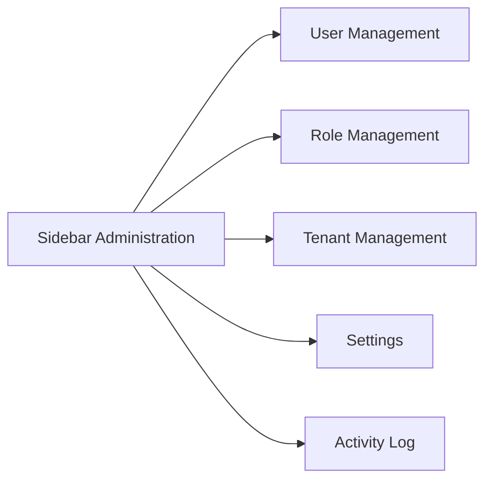
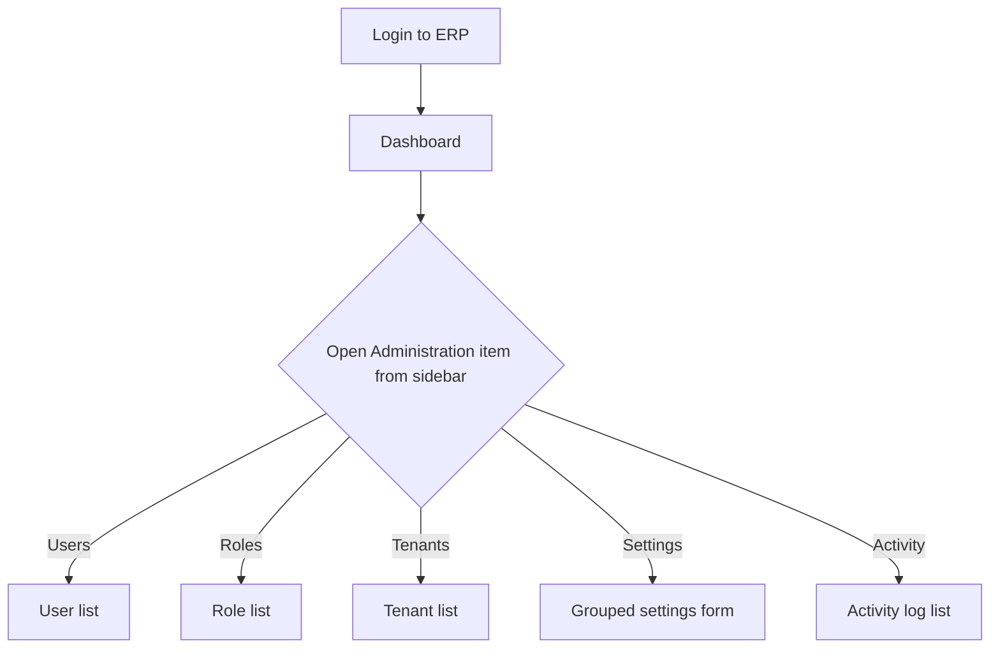
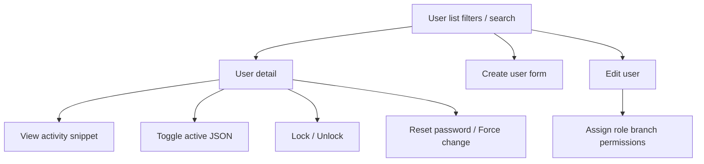
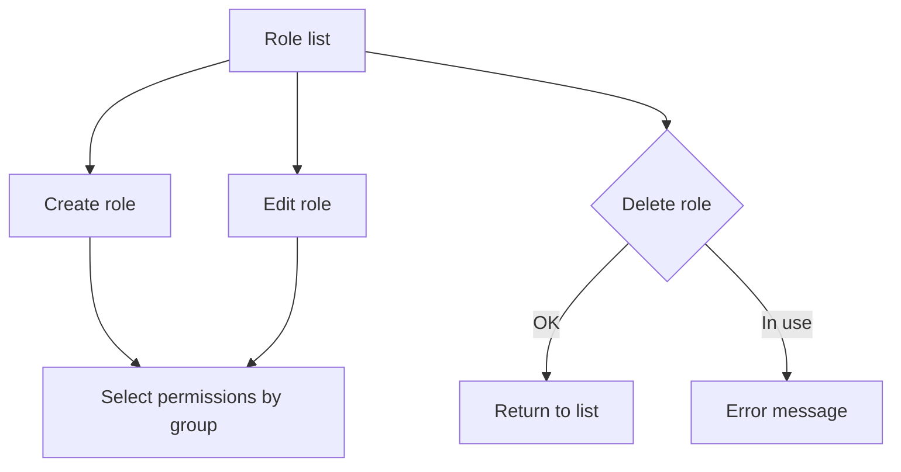
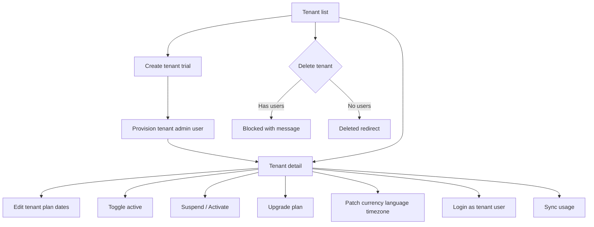
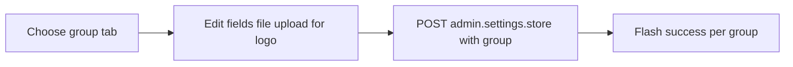
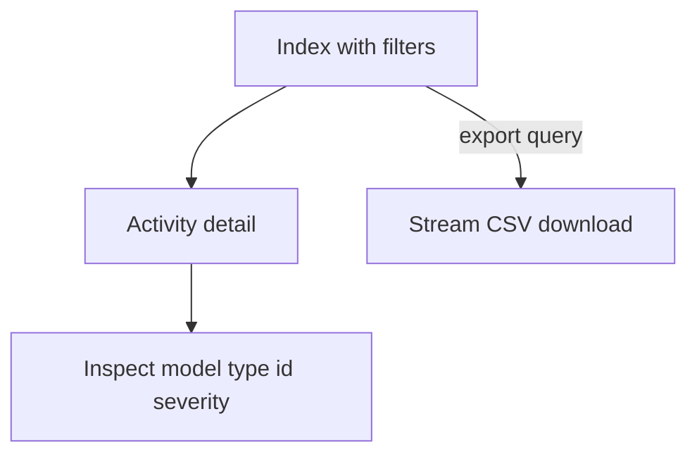
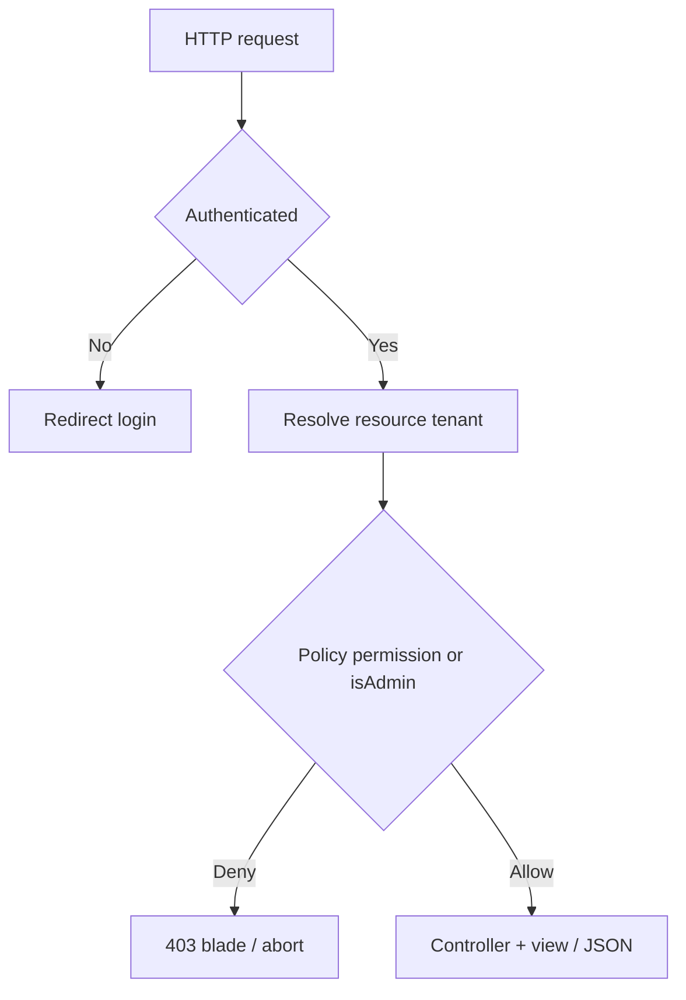

# Administration – UX flow diagrams

Mermaid diagrams for **navigation** and **primary admin journeys** under the sidebar category **Administration**. Render in GitHub, GitLab, VS Code (preview), or any Mermaid-compatible viewer.

---

## 1. Sidebar entry map

| Label | Primary route (named) |
| ----- | --------------------- |
| User Management | `admin.users.index` |
| Role Management | `admin.roles.index` |
| Tenant Management | `tenants.index` |
| Settings | `admin.settings` |
| Activity Log | `admin.activity.index` |

---

## 2. Operator journey: land on ERP → Administration task

---

## 3. User Management – list → detail → actions

---

## 4. Role Management – CRUD and permissions

---

## 5. Tenant Management – lifecycle

---

## 6. Settings – grouped save

---

## 7. Activity Log – investigate and export

---

## 8. Access pattern (conceptual)

**Note**: Activity Log controller requires **platform admin** (`isAdmin()`). User list and role list allow delegated access via permissions where middleware is applied.

---

## 9. Related documents

- [BRD.md](./BRD.md)
- [FRD.md](./FRD.md)
- [TDD.md](./TDD.md)
