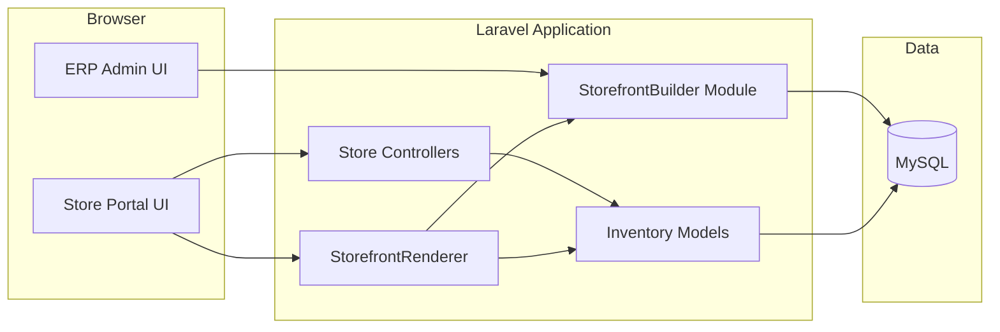

# Ecommerce – Technical Design Document (TDD)

> **Note**: In this folder, **TDD** means **Technical Design Document** (solution architecture). It is not “test-driven development.”

## 1. Purpose

Describe how the ecommerce capability is implemented in this codebase: routing, modules, rendering, tenancy, APIs, and extension points.

---

## 2. High-level architecture

---

## 3. Routing

### 3.1 Store Portal (`routes/web.php`)

| Prefix | Purpose |
| ------ | ------- |
| `/store` | Shop home, PDP, cart, checkout, auth, account |

Key named routes include `store.index`, `store.products.show`, `store.cart.*`, `store.checkout`, `store.account.*`.

### 3.2 ERP admin

| Prefix | Purpose |
| ------ | ------- |
| `/admin/storefront-builder` | Classic builder: settings, sections, publish, rollback, preview |
| `/admin/storefront-studio` | Visual Store Studio (React bundle + JSON layout APIs) |

### 3.3 APIs (`routes/api.php`)

| Prefix | Purpose |
| ------ | ------- |
| `storefront-builder` | Authenticated storefront resource + published payload |
| `storefront-builder/v2` | Layout CRUD, catalog samples, cart summary, Uomo presets, layout diff/import |
| `v1/storefront/boot` | Boot payload for storefront clients (middleware `storefront.boot`) |

---

## 4. Core components

### 4.1 Store controllers

Located under `App\Http\Controllers\Store\`:

- `ShopController` — listing/home and PDP.
- `CartController` — session cart read/write.
- `CheckoutController` — checkout form and order placement.
- `AccountController` — customer account (guard `customer`).
- `AuthController` — store login/register/logout.

### 4.2 Storefront Builder module

Path: `app/Modules/StorefrontBuilder/`

| Piece | Responsibility |
| ----- | -------------- |
| `StorefrontBuilderService` | Default storefront, pages/sections, **publish** snapshot with `studio_meta` and per-page `layout_schema` |
| `StorefrontRenderer` | Resolve published vs draft render payload for views |
| `LayoutSlotService` | `layout_slots` in storefront settings |
| `PageSchemaService` | Page schema **v2** (nodes, bindings), sync critical fields to legacy sections |
| `TemplateRegistryService` | Template keys, page types |
| `UomoFragmentService` | Optional extracted HTML fragments under `storage/app/uomo-fragments/` |

Models include `Storefront`, `StorefrontPage`, `StorefrontSection`, `StorefrontPublishVersion`, etc.

### 4.3 Views

- Store shell: `resources/views/store/layouts/portal.blade.php` (builder-driven sections, optional Uomo assets).
- ERP builder: `resources/views/erp/storefront-builder/`.
- Studio: `resources/views/erp/storefront-studio/index.blade.php` + compiled `public/js/storefront-studio.js` (Laravel Mix from `resources/js/storefront-studio.jsx`).

---

## 5. Data model (conceptual)

| Area | Entities (indicative) |
| ---- | ----------------------- |
| Catalog | `Product`, `Category` (tenant-scoped; ecommerce flags) |
| Storefront config | `storefronts`, `storefront_pages`, `storefront_sections`, `layout_schema` on pages |
| Publishing | `storefront_publish_versions` with JSON **snapshot** |
| Orders | `Order` and related models consumed by admin + customer account |

Tenancy uses `BelongsToTenant` / `TenantScope` on relevant models.

---

## 6. Page schema v2 (Studio)

- Stored on `storefront_pages.layout_schema` as JSON.
- When null/legacy, `PageSchemaService::resolvedSchema()` can derive from `storefront_sections`.
- Publish copies `layout_schema` into the version snapshot for reproducible renders.

Bindings (e.g. `erp.products.list`) are declarative; runtime resolution stays in PHP/renderer paths—not arbitrary code execution from JSON.

---

## 7. Caching & performance

- Render cache invalidation tied to storefront publish/rollback and builder updates (`forgetRenderCache` patterns in services).
- Studio catalog sample endpoints may use short TTL caching keyed by tenant (see `StorefrontStudioController`).

---

## 8. Security

| Concern | Mitigation |
| ------- | ---------- |
| Tenant isolation | Global scopes + tenant middleware on APIs |
| CSRF | Web routes use Laravel CSRF; SPA uses session + `X-XSRF-TOKEN` |
| API access | Sanctum + tenant middleware for builder v2 |
| Boot token | `storefront.boot` middleware on boot endpoint |

---

## 9. Asset pipeline

- **PHP**: Composer dependencies.
- **JS/CSS**: Laravel Mix (`webpack.mix.js`); React entry for Studio.
- **Docker**: optional `node-assets` service in `docker-compose.yml` (`--profile assets`) for `npm install` / `npm run production` without host Node.

---

## 10. Extension points

- New section types: extend `PageSchemaService` mapping and Blade/partials used by `StorefrontRenderer`.
- New binding sources: implement resolver services used by renderer/components—not inline in JSON.
- APIs: extend `storefront-builder/v2` with versioned prefixes.

---

## 11. Related documents

- [BRD.md](./BRD.md)
- [FRD.md](./FRD.md)
- [UX-flow-diagram.md](./UX-flow-diagram.md)
- [../storefront-builder-phases.md](../storefront-builder-phases.md)
