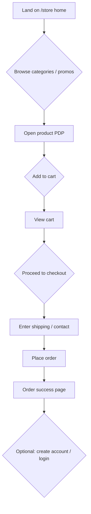
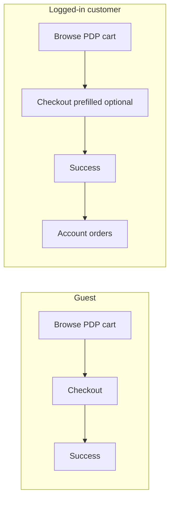
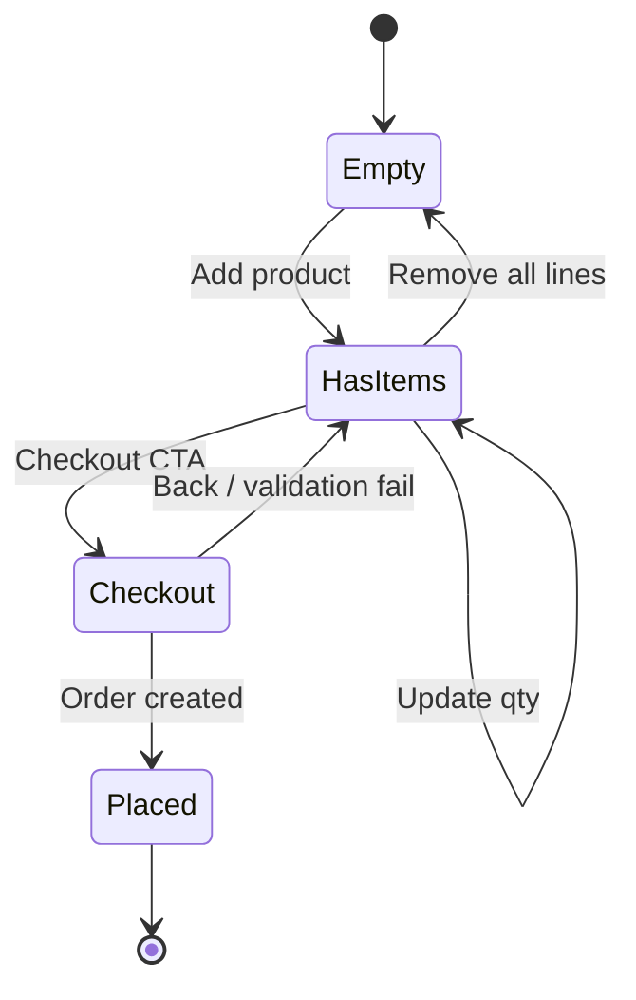
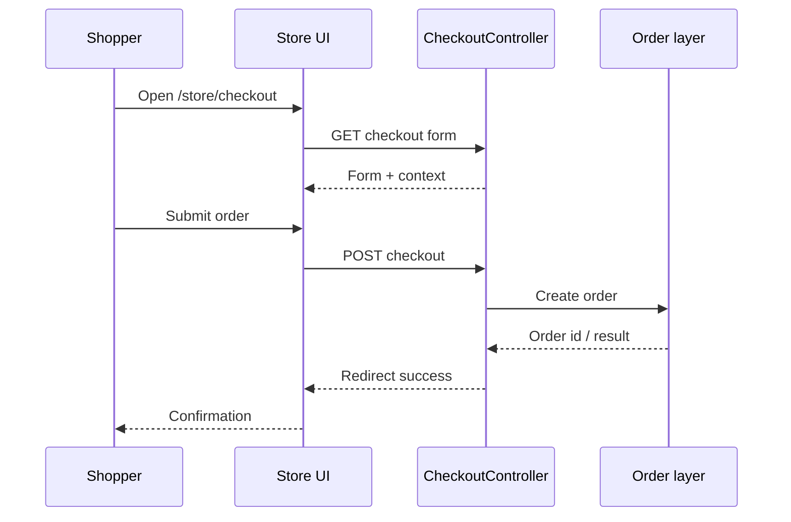
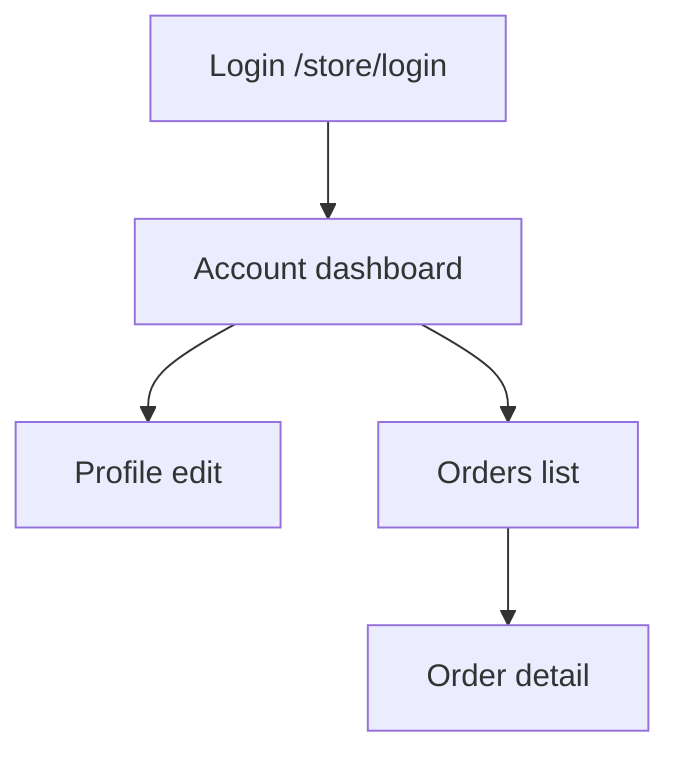
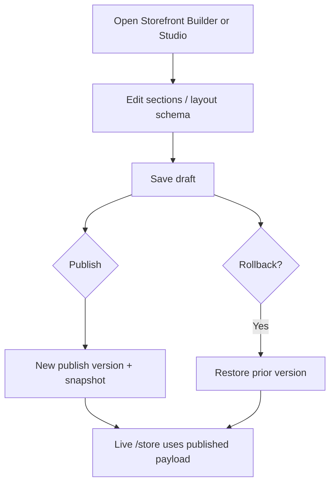
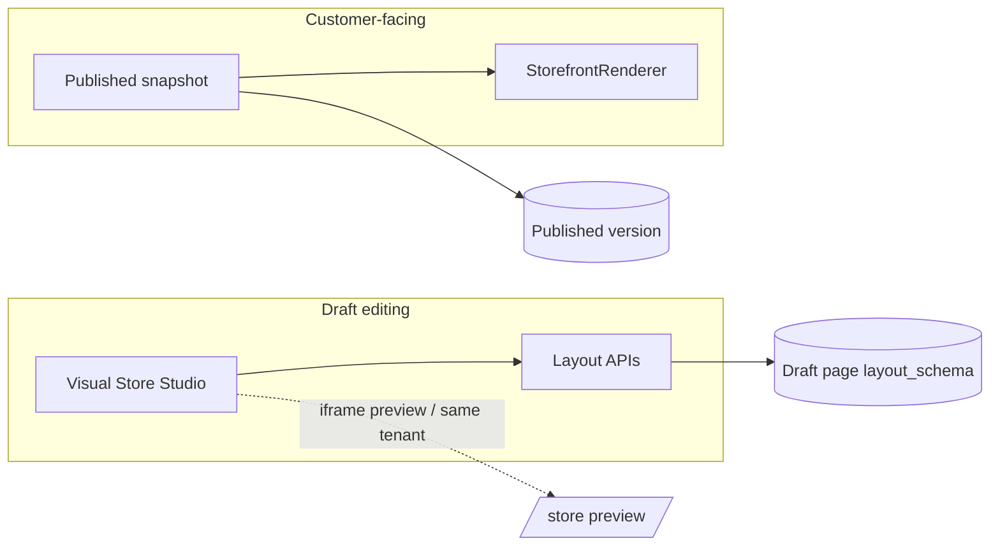

# Ecommerce – UX flow diagrams

Mermaid diagrams for primary journeys. Render in GitHub, GitLab, VS Code (preview), or any Mermaid-compatible viewer.

---

## 1. Customer shopping journey (happy path)

---

## 2. Guest vs authenticated paths

---

## 3. Cart state machine (conceptual)

---

## 4. Checkout sequence

---

## 5. Customer account (post-purchase)

---

## 6. ERP staff: storefront change (draft → publish)

---

## 7. Studio preview vs live (conceptual)

---

## 8. Related documents

- [BRD.md](./BRD.md)
- [FRD.md](./FRD.md)
- [TDD.md](./TDD.md)
